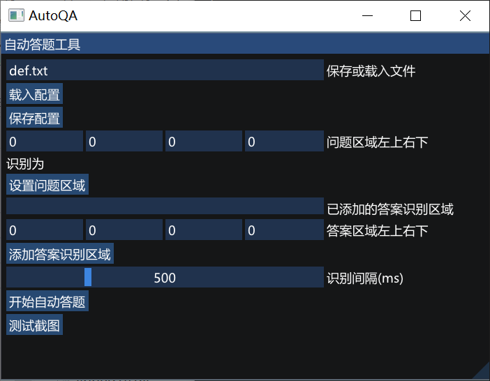

# AutoQA
自动答题工具

## 项目依赖
- onnxruntime 自 https://github.com/microsoft/onnxruntime/releases 下载后 放入此文件夹或自行更改CMakeListsCMAK
- vcpkg (opencv,numcpp,xlnt) 
- https://github.com/duckie/difflib python difflib c++实现
- https://github.com/CoireLen/CnorcCpp cnocr c++ 实现
- https://github.com/CoireLen/AutoGuiCPP_Win.git autogui gui操作库 
